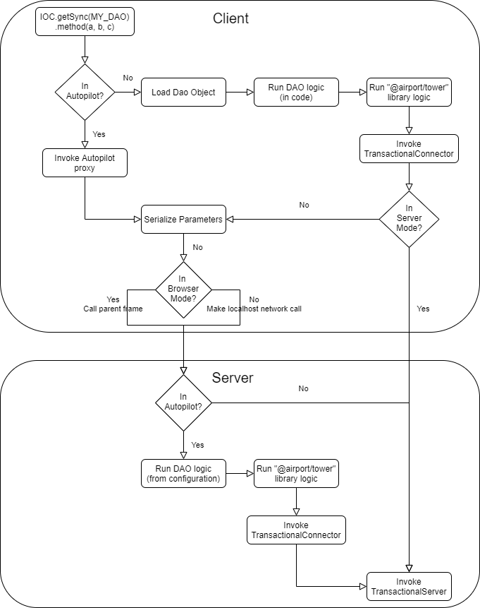

# AIRport - Autonomous Interdependent Repository port


1. [Description](#description)
2. [Blockchain](#blockchain)

## Description <a name="description"></a>
* Allows the Application End Users to seamlessly share the data only with
  selected Users.
* Lowers the barrier to entry for new Apps as they can reuse existing schemas
  or write add-on functionality to existing Apps.
* Lowers the barrier to entry by providing exiting data to new Apps.
* Allows hybrid applications where part of the data is centralized (for
  large scale sharing) and part is in private Repositories.
* WIP: Minimal code application library, all CRUD logic is installed via
declarative JSON config into the database itself.
* PLANNED: Automatic schema upgrades with enforced backward compatibility 

- The problem:

Decentralized Applications (DApps) lack an easy-to-use database layer.

- Our solution:

AIRport a decentralized relational database of Repositories.  Repositories
are virtual databases, each with its own transaction log.  Each Repository has
a globally unique identifier that allows to distinguish it from other
repositories in the same relational database (such as WebSql, or SqLite in
a Cordova based App). For two Users to share a Repository it must be present
on their devices, and the schemas used by that repository must be installed
in AIRport databases on those devices.


Each device/phone contains a single AIRport database that is shared by all
applications on that device.  The composition of the applications on each
device can be different.  The composition of the schemas installed in each
AIRport database on each device can be different as well.  Each database
contains only the Repositories the user of that device decides to keep on it.


    For example in an event tracking App data for each event is a separate Repository.
    Other Applications can build upon this App's schema and provide functionality
    (such as  event specific chat and voting systems) in their own schemas. Using all
    of these Apps the users add data to the same Repositories (for the the same
    events).  Thus Repositories for events span schemas of all the Apps that together
    provide better functionality than each one separately.  AIRport enables synergies
    between Apps where "the whole is greater than the sum its parts" thus reducing the
    overall costs.

Each repository is completely autonomous and can be added to a host relational
database and/or removed from it, at any time, without affecting other
repositories.  Repositories can have references to each other thus depending
on data that other repository contains, but must be usable without referenced
repositories (thus being both interdependent and autonomous).

## Blockchain based<a name="blockchain"></a>

AIRport Repositories have blockchain based transaction log storage to enable
communication between devices. AIRport is fully functional off-line, commits 
are made locally and are added to the "longest chain" once device is back on-line.
Each Repository transaction log is a separate chain and itself can consist of 
sub-chains if devices go out of sync. Thus, the Repository transaction log is a
Directed Acyclic Graph with each commit being a separate block and all 
sub-chains are resolved to the "longest chain" via timestamp based conflict
resolution mechanism. 

    For examle if Alice modifies record 1 while being offline and Charlie
    modifies the same record also offline but at a later time then both
    with be notified of the conflict and automatic conflict resolution
    will pick the latest column values while allowing for manual confict
    resolution.


Based on my current limited understanding of blockchains:

A Repository chain can be integrated with IPFS since it supports DAG
datastructure and is storage centric.  Integrations with other chains
are possible: A Repository chain can be tied to the chains of the
individual chains of creators/participators in the Repository.  In
turn, those can be integrated into any 3.0 blockchain.

## Installation process

The process of installing AIRport is:

*  User navigates to a consumer Application that uses AIRport and creates
   a Repository
*  Application prompts the user to install AIRport database App (if not
   installed already)
*  User installs AIRport App
*  The consumer application creates the private Repository and prompts
   to add other participating users
*  Creating user shares the Repository, and the App notifies new users


## API

AIRport offers refined, high productivity developer APIS:

* Simplified JPA annotations (no session concept, easier relations)
* GraphQL like query API
* GraphQL/Firebase like hybrid solution for mutation & access rules
* Automatic schema generation and installation
* WIP: Automatic interface and DAO stub generation

## Application collaboration

Core to AIRport is the idea is for multiple applications to collaborate 
and re-use data.  The two key points here are:

* User is in control of their data they allow applications to access 
  their data (usually only a part of their data).
* Applications are in control of sharing schemas with other applications
- they can allow or deny access to their schemas.

This the applications only interact with the device-local database, making AIRport
fully operational in offline-mode.  The database is in charge of maintaining the
repositories contained in it.  It may occasionally prompt the user to purge
infrequently used repositories (or may do so automatically if not configured),
leaving them only in the cloud backup.  The applications however may request the
user to load additional repositories from the cloud, for processing.

## Autopilot client for Apps

AIRport provides "autopilot" client for Apps where CRUD code is
pre-processed by "@airport/runway" at build time and resides on the
AIRport server, not in the client-side library:




"@airport/runway" generates TypeScript interfaces which are used to define
the CRUD and Enitty API of the underlying schema.  The actual CRUD logic 
is defined in the schema configuration file, which is loaded into the 
device's AIRport database directly.  The config file is generated from
the annotated/decorator Entities and the DAO decorators that contain the
CRUD logic.  In "autopilot" mode only the dependency injection tokens are
included from the schema project (along with the "@airport/di",
"@airport/autopilot" and "@airport/pressurization" libraries).


## Technical details

### On the stack dependency injection

Since AIRport instances will be running on mobile devices, it has its own
"on the stack" Dependency Injection (DI for short) framework that allows it
to easily upgrade framework versions of code "on-the-fly", without requiring 
application restarts or interruptions in service.  Thus, dependency injection
is done "on the stack" (in the methods of the framework objects and not
in the constructors of these objects).  The idea is that during an upgrade,
all in progress requests are allowed to complete while all pending requests
are halted (via async functions) at the very start.  Once all requests have
cleared an upgrade takes place (within the libs\di library, just replacing
old references to objects with new ones), then the remaining requests are resumed.
This works well since every operation in AIRport is "top-level transactional".

### Transactionality

For a number of reasons (primarily WebSql transactional limitations) all
transactions in AIRport must be sent over to the database in one shot.
That means that an entire object graph is sent it and is processed
according to the rules of a particular operation *(more on this later)*.

### Convention over configuration

AIRport is an opinionated framework that assumes "convention over configuration"
for the following things:

#### Separate schema project

Each schema is defined in its own project.  The reason - schemas should be reusable
across applications.  Someone might find reuse even for most trivial of projects that
you think won't be needed ever again.  The guiding assumption is that it is certainly
better to have fewer schemas (globally) and multiple applications reusing (parts of)
the same schemas.

#### Schema project directory structure

All schema projects share a common directory structure.

* src - all source lives under this folder
* lib - all compiled JavaScript lives under this folder

* src/ddl - all entities (annotated with JPA-like decorators) live here
* src/types - **work in progress** all entity fields get unique types that
  can then be referenced in the code (and searched for to trace the usage
  of specific fields)
* src/generated - generated code goes here (for queries, mutations and DAOs)
* src/dao - **work in progress** automatically generated Data Access Objects stubs
* (which extend common functionality defined in generated folder) go here
* tokens.ts - **work in progress** automatically generated Dependency Injection tokens for all DAO objects.
* index.ts - **work in progress** is automatically maintained

#### Code generation

In order for the GraphQL like language to work (and for additional type safety)
AIRport (actually the generators/runway library) generates a number of objects
in the src/generated directory.  Most of the API's using these
are abstracted away by the DAO (Data Access Objects) that are used to contain
all query/mutation/access rule logic.

#### Configuration file generation

DAO logic is mostly meant to be defined inside TypeScript decorators, those in 
turn are pre-processed and (along with entity definitions) are placed inside
a configuration JSON file.  This is the file that is read by the database
instance on the device when a schema is first installed (or is being upgraded).
Of course it is possible to write custom queries as well, though at the
cost of having to include quite a bit of framework code in your application
3rd party bundles.

### Entity Definitions

Entity definitions stick as much as possible to Java's JPA
syntax.  There are a few notable departures:

* AIRport does not have the concept of a session,
  hence nothing related to JPA sessions is present
* AIRport explicitly specifies all persist and delete
  cascading via GraphQL like syntax (with Firebase security
  rule flavoring), so cascade rules are specific
  to each mutation operation and are defined there.
* Syntax is in valid TypeScript 

```typescript
@Entity()
export class Parent {

    @Id()
    @GeneratedValue()
    key: number;

    value: string;

    @OneToMany({mappedBy: 'parent'})
    children: Child[];
}

@Entity()
export class Child {

    @Id()
    @GeneratedValue()
    key: number;

    value: string;

    @ManyToOne()
    parent: Parent;
}
```

### Data Access Objects (DAOs)

After you've created your entities you run the @airport/runway generator
to generate all of the necessary code artifacts, including stub DAOs (
Data Access objects).  Now you can enter the mutation and query logic:

```typescript
import {
  ANOTHER,
  Y
}                         from '@airport/air-control'
import {
  Persist,
  RULES
}                         from '@airport/check-in'
import {DI}               from '@airport/di'
import {
  BaseParentDao,
  IBaseParentDao,
  ParentGraph,
  Q
}                         from '../generated/generated'
import {PARENT_DAO}       from '../tokens'
import {
  IParent,
  IParentDao,
  IExampleContext
}                         from '../types/types'

export class ParentDao 
       extends BaseParentDao 
       implements IParentDao {
    @Persist<ParentGraph>({
      key: Y,
      value: null || RULES.anyString(), 
      children: [{ 
      	key: Y, 
        value: null || 'Child_' + RULES.anyString() 
      } || null, ANOTHER(0, 3)]
    })
    create
  
    @Find<IParent>((parentValue) => ({
      select: {
      	children: {}
      },
      from: [
        p = Q.Parent
      ],
      where: p.value.like(parentValue)
    }))
    findByValue

}
DI.set(PARENT_DAO, ParentDao)
```

Most of the imports are coming from either the AIRport framework itself
or the generated folders and are already made for you in the generated
file.

You can now run the @airport/runway generator again to populate the
DAO interfaces (and rules.json file which is passed to the AIR databases
and contains the necessary declarative logic, without having to run any
external executables in the database, thus making the rules secure
to add to the db).  @airport/runway parses the Dao files using the
Typescript compiler and extracts the rules from the @Persist and
@Query decorators and composes the same rules in declarative JSON 
format (along with the schema definition).

```typescript
export interface IParentDao 
       extends IBaseParentDao {
    create(
      parent: IParent | IParent[],
      context?: IExampleContext
    ): Promise<void>

    findByValue(
      parentValue: IParent_Value,
      context?: IExampleContext
    ): Promise<IParent[]>

}
```

The DAO interfaces, along with the entity interfaces is all that is needed
to use the AIR database API.  Hence, AIRport provides a zero-application
code solution, with only a slim shim necessary to talk to the local AIRport
database (the only piece of runnable code from the schema project that must 
be imported from the schema project is the tokens.ts file):

```typescript
await DI.getSync(PARENT_DAO).create(parent)
```

Note how the Dependency Inject system automatically creates all of the
necessary injection tokens and maintains the tokens.ts file for you.

```typescript
import {system}             from '@airport/di'
import {IParentDao}         from './types/dao/ParentDao'
import {IChildDao}         from './types/dao/ChildDao'

const schema = system('example').lib('schema')

export const CHILD_DAO = schema.token<IChildDao>('IChildDao')
export const PARENT_DAO = schema.token<IParentDao>('IParentDao')
```

## Directory Structure
Internal directory structure of the AIRport meta-repository.

[apis](/apis)
Various internal and external APIs used by for AIRport entity definitions,
query and persistence definitions and various communication modules.

[apps](/apps)
Applications needed for AIRport to work (such us a mobile app and a sync
server).

[db](/db)
Database adapter implementations.

[generators](/generators)
Various code generators needed for AIRport projects to work.

[highway](/highway)
Large server implementation (in the process of being moved to its own project).

[libs](/libs)
Various internal/external libraries.

[presentations](/presentations)
Material for past and future presentations made on Autonomous Interdepedent
Repositories and AIRport.

[schemas](/schemas)
Internal database schemas needed for AIRport to operate.

## License
AIRport is distributed under the terms of both the MIT license and the Apache License (Version 2.0).

See [LICENSE-APACHE](LICENSE-APACHE), [LICENSE-MIT](LICENSE-MIT)

## ...
