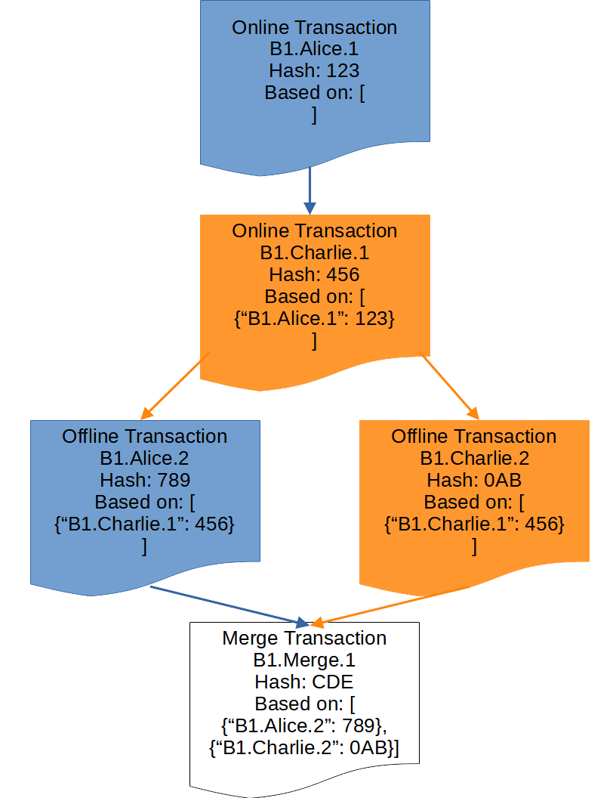

# AIRport - [Autonomous Interdependent Repository](https://patents.google.com/patent/US10902016B2/) port


* [Description](#description)
  * [The Problem](#problem)
  * [The Solution](#solution)
* [Blockchain](#blockchain)
* [Storage](#storage)
* [Access Control](#access-control)
* [Data Reuse](#data-reuse)
* [Developer Experience](#developer-experience)
* [Technical Details](#tech-details)

## Description <a name="description"></a>
AIRport allows Decentralized Applications to interoperate by providing a relational
database and an API framework.

AIRport data is stored in repositories that work in isolation but can be automatically
retrieved and joined together.

### The problem: <a name="problem"></a>

Decentralized Applications (DApps) lack an easy-to-use database layer.

Right now there is no easy way to write DApps that rely on complex relational
schemas for data storage.  There is also no way for DApps to share data in
relational schemas.  And there is no way to share CRUD and business logic.

### The solution: <a name="solution"></a>

Repositories are virtual databases.

    AIRport database contains 2 schemas,
    one from App A and one from App B.  App A Schema contains table A__TABLE_II
    and App B Schema contains table B__TABLE_I.  There are 3 repositories.
    Repository B1 spans both tables (and both schemas).  Repository B2
    is contained in B__TABLE_I.  Repository C1 only spans tables in App
    B Schema (other tables are not pictured).
    


Records in AIRport tables are always identified by 3 columns:
* REPOSITORY_ID - this column contains the Repository's unique identifier
* REPOSITORY_ACTOR_ID - The id of an "Actor" that created or modified the record
* ACTOR_RECORD_ID - The id of the record, unique to Repository and Actor

Actor is a combination of User, using a Particular application on a particular
device. Combination of these Ids is globally unique.

AIRport database runs on user devices.  The composition of Apps on each
device is different.  The composition of schemas in AIRport database on 
each device can be different.  Each database contains only the Repositories
the user keeps on it.


    An Event App creates a schema for tracking events. Another App builds
    a Chat System for event participants and uses the Event App schema
    (as well as it's own schema).  Another App builds Event Voting and uses
    the schemas for both Event and Event Chat. The data for all three Apps is 
    stored in Event specific Repositories, one repository per event.  Thus
    Repositories spans across all App schemas.  Together the 3 Apps provide a rich
    feacher set that can be extended by even more Apps.

Each repository is completely autonomous and can be added to a host relational
database or removed from it (at any time) without affecting other
repositories.  Repositories can have references to each other.

Repositories are both Autonomous and Interdependent. If foreign keys
point to other repositories the records they point to are copied into 
the referencing repository.  Queries can run
either against a single repository or across repositories (pulling them from
the network as needed). This is acomplished by keeping foreign keys to record
copies in the same reostiroies and to original records in the other
repositories.

## Blockchain<a name="blockchain"></a>

AIRport Repositories have blockchain based transaction logs.  Each Repository
is a private blockchain.  Repository transaction log
is a Directed Acyclic Graph with each commit being a separate block. All 
sub-chains are resolved to the "longest chain" via timestamps. 

    If Alice modifies record 1 while being offline and Charlie
    modifies the same record also offline but at a later time then both
    with be notified of the conflict.  Automatic conflict resolution
    will pick the latest column values.




## Storage<a name="storage"></a>

AIRport uses [IPFS](https://github.com/ipfs/js-ipfs) for permanent storage of Repositories and [Arweave](https://github.com/ArweaveTeam/arweave-js) for permanent storage.

## Access Control<a name="access-control"></a>

* Usera are in control of their data. They control Application access 
  their Repositories.
* Applications controls sharing schemas with other Applications.

## Data Reuse<a name="data-reuse"></a>
If data already exists in a repository new App can use it,
without requiring the user to enter it (again, as it was done
for first App).

## Developer Experience<a name="developer-experience"></a>
AIRport offers:

* Simplified JPA annotations (tracking updates via hidden state - no session)
* Compile time checked GraphQL like query API
* Simple API calls for cross-application interoperability
* Automatic schema generation and installation

This reduces the development effort and allows
App creators to focus on business logic, instead mechanics of storing data.
AIRport queries return object trees or fully interlinked object
graphs.

## Technical details<a name="tech-details"></a>

### Application VMs

Application run in their own VMs.  In Web mode these VMs
are IFrames (isolated from each other because they are from different domains).
Application VMs interoperate via the parent AIRport frame.
External aplications (in other browser tabs) access these Application VMs
also through the AIRport tab.

In Native Application mode Application run in V8 VMs.

### Installation

*  User navigates to a web page that uses AIRport and saves/retrieves data.
*  A new tab is opened in the background with AIRport framework in it
*  User continues to use the app as normal, Apps in other tabs use the
same AIRport tab.

Browser tab is not used if AIRport is installed natively.

### Queries
Apps can define entities which depend on entities in other
Apps, via @ManyToOne() relations.  Apps can build joins that include 
entities from other Apps.

### APIs
Public API methods are annotated with @Api() decorator.  Apps can
invoke @Api() methods of other Apps.

#### Nested Persistence Operations
@Api() calls are used to run validation logic and persist entities. When saving
entities, Application must first call the @Api() methods
of the Applications with the objects it depends on.   


### Entity Definitions

"
```typescript
@Entity()
export class Parent extends AirEntity {

    value: string;

    @OneToMany({mappedBy: 'parent'})
    children: Child[];
}

@Entity()
export class Child extends AirEntity {

    value: string;

    @ManyToOne()
    parent: Parent;
}
```

### Data Access Objects (DAOs)

```typescript
@Injected()
export class ParentDao 
       extends BaseParentDao {

    async findById(
      parentUuId: string
    ) {
      let p: QParent,
          c: QChild
      return await this._find({
        select: {
          '*': Y,
      	  children: {}
        },
        from: [
          p = Q.Parent,
          c  = p.children.leftJoin()
        ],
        where: p.equals(parentUuId)
      })
    }

}
```

### APIs

```typescript
@Injected()
export class ParentApi {

    @Inject()
    parentDao: ParentDao

    @Api()
    async save(
      parent: Parent
    ) {
      await this.parentDao.save(parent)
    }

    @Api()
    async findById(
      parentUuId: string
    ) {
      return await this.parentDao.findById(parentUuId)
    }

}
```

## Directory Structure

[apis](/apis)
Internal and external APIs.

[databases](/databases)
Database adapters.

[engines](/engines)
Core Logic of AIRport.

[generators](/generators)
Code generators.

[libs](/libs)
Libraries.

[platforms](/platforms)
Platform adaptors for Web and Native.

[schemas](/schemas)
Internal AIRport schemas.

## License
AIRport is distributed under the terms of both the MIT license and the Apache License (Version 2.0).

See [LICENSE-APACHE](LICENSE-APACHE), [LICENSE-MIT](LICENSE-MIT)

## ...
